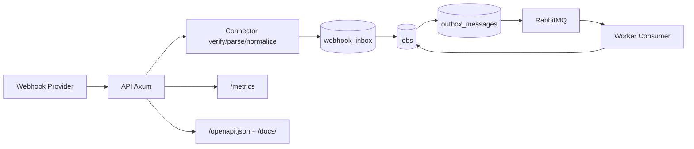

# Relayforge

Multi-tenant webhook ingestion and job orchestration platform built with Rust.

## Problem Statement

Production webhook systems fail in predictable ways:

- duplicate deliveries create duplicate jobs
- direct publish to MQ causes DB/MQ inconsistency
- missing idempotency creates non-deterministic behavior
- weak observability makes incidents hard to debug
- multi-tenant secret management is often unsafe or ad hoc
- admin endpoints without RBAC are a security risk

Relayforge was built to solve these issues with production-style architecture, not a demo-only setup.

## What This System Does

- Accepts webhooks via `POST /webhooks/{source}`
- Verifies signatures for:
  - `generic` (`X-Signature`)
  - `github` (`X-Hub-Signature-256`)
  - `stripe` (`Stripe-Signature`)
- Normalizes provider payloads into a shared `DomainEvent`
- Persists inbox + jobs in Postgres with idempotent upsert
- Uses Outbox Pattern for reliable RabbitMQ publishing
- Runs worker publisher/consumer with retry + dead-letter flow
- Exposes health/readiness:
  - `GET /healthz`
  - `GET /readyz`
- Exposes observability:
  - `GET /metrics` (Prometheus)
  - structured logs with correlation IDs
- Exposes docs:
  - `GET /openapi.json`
  - `GET /docs/` (Swagger UI)
- Protects admin routes (`/admin/*`) with Bearer auth + RBAC (`viewer/operator/admin`)

## Architecture



## Resume-Oriented Technical Choices

| Technology | Where It Is Used | Why It Was Chosen |
|---|---|---|
| `tokio` | API and worker runtime | Mature async ecosystem in Rust |
| `axum` | HTTP routes/handlers | Clean integration with Tower middleware |
| `hyper` | Underlying HTTP engine | High-performance and stable transport layer |
| `tower`, `tower-http` | request-id, tracing, limits, panic catch | Composable middleware and hardening controls |
| `serde`, `serde_json` | payload parsing and response serialization | Standard Rust JSON tooling |
| `sqlx` + Postgres | persistence and migrations | type-safe queries + operationally reliable DB |
| `lapin` + RabbitMQ | publisher/consumer messaging | explicit control over publish/consume semantics |
| `tracing`, `tracing-subscriber` | structured logs and trace context | fast debugging with correlation IDs |
| `prometheus` | metrics registry/export | standard monitoring integration |
| `hmac`, `sha2`, `subtle` | signature verification | secure HMAC checks + constant-time compare |
| `testcontainers` + `reqwest` | integration and E2E tests | realistic tests against real dependencies |
| `k6` | load testing | reproducible performance proof for resume |

## Security and Hardening

### Stripe anti-replay (completed)

- Signature verification (`Stripe-Signature`) is required.
- Timestamp freshness is enforced with tolerance window:
  - `WEBHOOKS__STRIPE_SIGNATURE_TOLERANCE_SECONDS`
- Event-level idempotency store is persisted in DB:
  - table: `stripe_event_idempotency`
  - uniqueness: `(tenant_id, event_id)`
- Replay behavior:
  - stale timestamp -> `401`
  - same event replay for same tenant -> `409`

### Tenant-aware limits (completed)

- Per-tenant token bucket rate limiter (in-memory):
  - `HARDENING__TENANT_RATE_LIMIT_PER_SECOND`
  - `HARDENING__TENANT_RATE_LIMIT_BURST`
- Per-tenant daily quota (DB-backed atomic upsert):
  - `HARDENING__TENANT_DAILY_QUOTA`
  - table: `tenant_daily_quota_usage`
- Response on limit/quota hit: `429`

### Additional protections

- Global ingress rate limiting on webhook routes
- Request body size limit (`413` on oversized payload)
- Provider payload schema validation (`serde` + strict parsing)
- Tenant/provider secrets loaded from DB first, env as fallback
- Admin API key validation with hashed keys + RBAC

## Observability

Implemented metrics:

- `http_requests_total{route,method,status}`
- `http_request_duration_seconds` (histogram)
- `jobs_created_total{source}`
- `jobs_processed_total{status}`
- `job_processing_duration_seconds` (histogram)
- `job_retries_total`
- `dlq_messages_total`
- `outbox_pending_count` (gauge)

Distributed tracing:

- OpenTelemetry (OTLP) pipeline via `tracing-opentelemetry`
- W3C propagation headers: `traceparent`, `tracestate`, `baggage`
- end-to-end context propagation across API -> outbox -> worker retries
- key env vars: `OTEL__ENABLED`, `OTEL__EXPORTER_OTLP_ENDPOINT`, `OTEL__EXPORTER_OTLP_TIMEOUT_MS`

Local observability stack:

- Prometheus config: `observability/prometheus/prometheus.yml`
- Grafana provisioning and dashboard: `observability/grafana/`
- Alert rules: `observability/prometheus/alerts.yml`
- SLO definitions: `observability/slo.md`
- Operational runbook: `observability/runbook.md`
- Start with:

```bash
docker compose up -d prometheus grafana alertmanager otel-collector
```

## Performance Proof

Reproducible load script:

```bash
./scripts/perf/run_ingest_perf.sh
```

Latest recorded run (`2026-02-14`, `RATE=300`, `DURATION=20s`):

| Metric | Value |
|---|---:|
| Throughput (req/s) | 164.50 |
| p95 latency (ms) | 2373.05 |
| p99 latency (ms) | 2392.12 |
| Error rate (%) | 0.00 |
| API peak CPU (%) | 71.00 |
| API peak RAM (MiB) | 48.28 |

Hot-path benchmark:

```bash
ITERATIONS=100000 ./scripts/perf/run_hot_path_bench.sh
```

| Case | Payload bytes | Ops/s |
|---|---:|---:|
| hmac_signature_hex | 256 | 855,855.71 |
| payload_hash_hex | 256 | 1,878,018.03 |
| hmac_signature_hex | 1024 | 471,231.42 |
| payload_hash_hex | 1024 | 502,538.55 |
| hmac_signature_hex | 4096 | 136,971.16 |
| payload_hash_hex | 4096 | 143,859.95 |

## Data Model (Key Tables)

- `webhook_inbox`: raw body, headers, payload hash, acceptance metadata
- `jobs`: dedup key, status machine, attempts, last_error, first/last inbox refs
- `outbox_messages`: reliable publish state with retry scheduling fields
- `tenant_provider_secrets`: per-tenant/per-provider secrets
- `admin_api_keys`: hashed keys with role
- `stripe_event_idempotency`: anti-replay idempotency store
- `tenant_daily_quota_usage`: per-tenant daily usage counter

## Testing

Run all API tests:

```bash
cargo test -p api
```

Important coverage:

- `hardening_abuse`: burst abuse (`1000` req) and oversized payload (`413`)
- `level9_multi_tenant_connectors`: tenant secret resolution + event normalization
- `admin_rbac`: role-based authorization checks for admin namespace
- `docs_openapi`: OpenAPI/Swagger endpoints availability
- `tenant_protection`: Stripe anti-replay + per-tenant rate/quota enforcement
- `worker/level5_e2e`: retry, dead-letter, reprocess flow with real Postgres/RabbitMQ

## Quick Start

```bash
docker compose up -d
cp .env.example .env
cargo run -p api --bin api
```

Then open:

- `http://127.0.0.1:8080/healthz`
- `http://127.0.0.1:8080/readyz`
- `http://127.0.0.1:8080/docs/`
- `http://127.0.0.1:8080/metrics`

## Challenges and How They Were Solved

| Challenge | Implementation |
|---|---|
| Duplicate webhooks creating duplicate jobs | transactional upsert + unique dedup key + inbox linkage |
| DB/MQ consistency risk | Outbox pattern instead of direct publish |
| Stripe replay risks | freshness window + DB-backed event idempotency |
| Multi-tenant secret complexity | DB source of truth + env fallback |
| Abuse traffic and noisy tenants | ingress limiter + per-tenant limiter + daily quota |
| Admin endpoint exposure | Bearer auth + role hierarchy + hashed DB keys |
| Low observability in incidents | structured logs + correlation IDs + Prometheus + Grafana |
